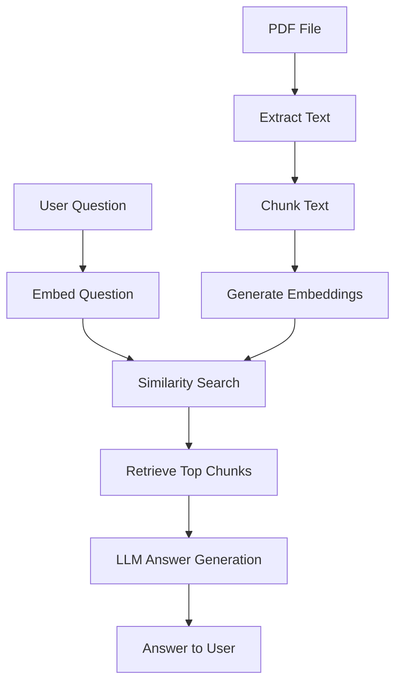

# PDF Question Answering with Basic RAG (CLI)

This project is a simple **command-line PDF Question Answering tool** that allows users to ask questions about the contents of a PDF file. It uses a **basic Retrieval-Augmented Generation (RAG)** approach with OpenAI embeddings and a GPT model, without relying on high-level frameworks such as LangChain.

---

## Project Structure

```
AI-Task-02/
│
├── main.py              # Main Python script for the RAG CLI
├── example.pdf          # Sample PDF file
├── .env                 # Stores OPENAI_API_KEY (not committed)
├── .env.example         # Environment variable template
├── .gitignore           # Git ignore rules
└── README.md            # Project documentation
```

---

## 1. Setup Guide

### Prerequisites

- Python 3.10 or higher
- OpenAI API key
- pip (Python package manager)

---

### Steps to Set Up

#### 1. Clone the repository

```
git clone https://github.com/yourusername/pdf-rag-cli.git
cd pdf-rag-cli
```

---

#### 2. (Optional) Create a virtual environment

```
python -m venv venv
```

Activate the virtual environment:

- **Windows**
```
venv\Scripts\activate
```

- **macOS / Linux**
```
source venv/bin/activate
```

---

#### 3. Install dependencies

```
pip install openai python-dotenv pypdf numpy
```

---

#### 4. Configure OpenAI API key

Create a `.env` file in the project root and add your API key:

```
OPENAI_API_KEY=sk-proj-xxxxxxxxxxxxxxxxxxxxxxxxxxxxxxxxxxxxxxxx
```

**Notes:**
- Do not use quotes around the key
- Ensure `.env` is included in `.gitignore`

---

#### 5. Run the program

```
python main.py "C:\\full\\path\\to\\your\\pdf\\file.pdf"
```

Example:

```
python main.py "C:\\Users\\sanut\\OneDrive\\Documents\\AIGENX\\ai tasks\\AI-Task-02\\example.pdf"
```

---

## 2. Introduction & How It Works

This tool allows users to ask **natural language questions** based on the content of a given PDF file.

### How it works

1. The PDF file is read and text is extracted from all pages.
2. The extracted text is split into overlapping chunks.
3. Each chunk is converted into vector embeddings using OpenAI embeddings.
4. User questions are embedded and compared with document embeddings using cosine similarity.
5. The most relevant chunks are retrieved.
6. A GPT model generates an answer strictly based on the retrieved PDF content.

If the answer is not present in the PDF, the system explicitly states that it cannot find the answer.

---

## 3. Key Logic and Components

| Component | Purpose |
|---------|--------|
| `pypdf` | Extracts text from PDF pages |
| Text Chunking | Splits documents into manageable sections |
| OpenAI Embeddings | Converts text into vector representations |
| Cosine Similarity | Identifies the most relevant chunks |
| GPT Model | Generates grounded answers |
| RAG Pipeline | Combines retrieval and generation |

---

## 4. Application Flow



---

## 5. Weaknesses & Future Improvements

### Weaknesses

- Embeddings are recomputed on every run
- No persistent vector database
- Single-PDF support only
- Command-line interface only
- No OCR support for scanned PDFs

### Future Improvements

- Cache embeddings to improve performance
- Support multiple PDF files
- Add page-number citations in answers
- Integrate FAISS for large document collections
- Add OCR support for scanned PDFs
- Build a web interface using Flask or Streamlit

---

## Security Notes

- Never commit `.env` files
- Rotate API keys if they are exposed
- Use `.env.example` to document required environment variables

---

## License

This project is intended for educational and experimental purposes.